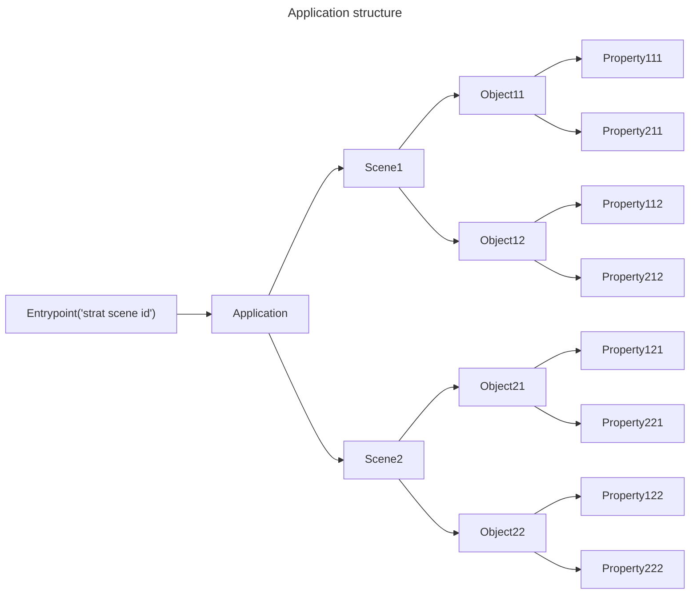

# SpaceRanger

A simple game in which you play as a pilot of a spaceship and fight other ships

# TODO

- [ ] Get rid off separate draw method call in game loop. Move draw logic in the rendering system.
